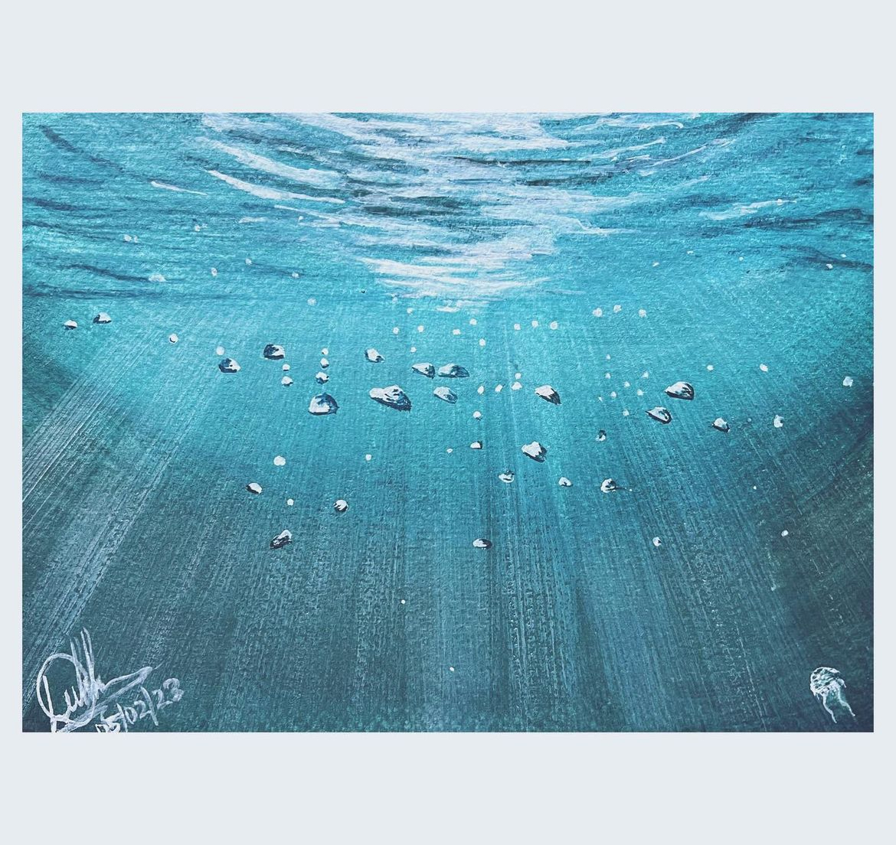
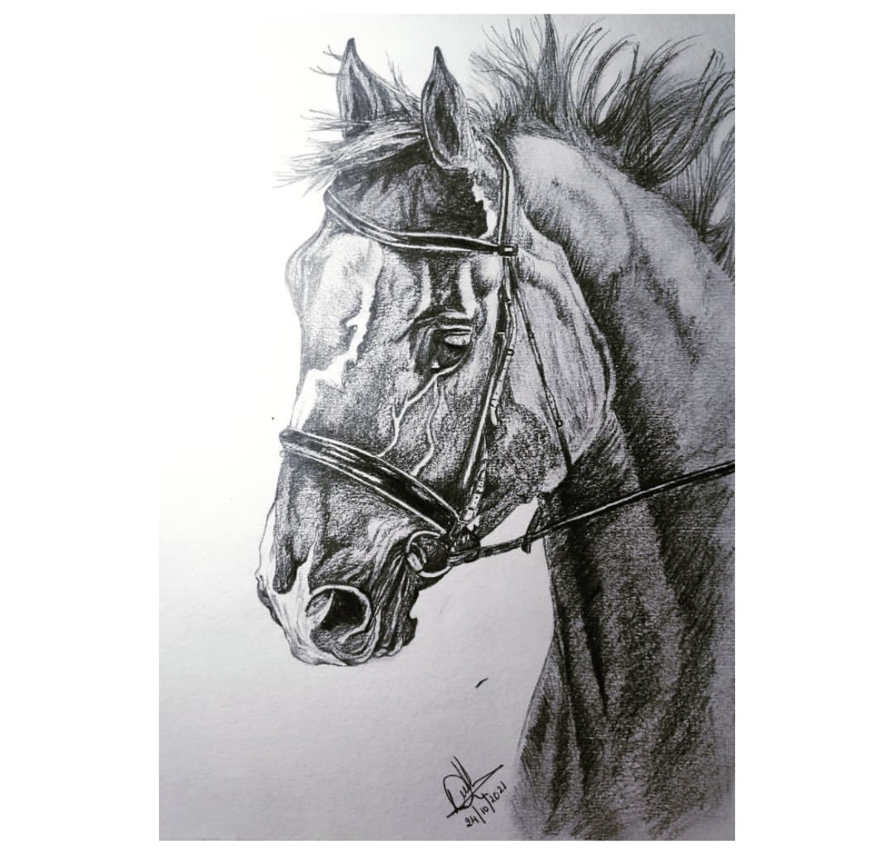
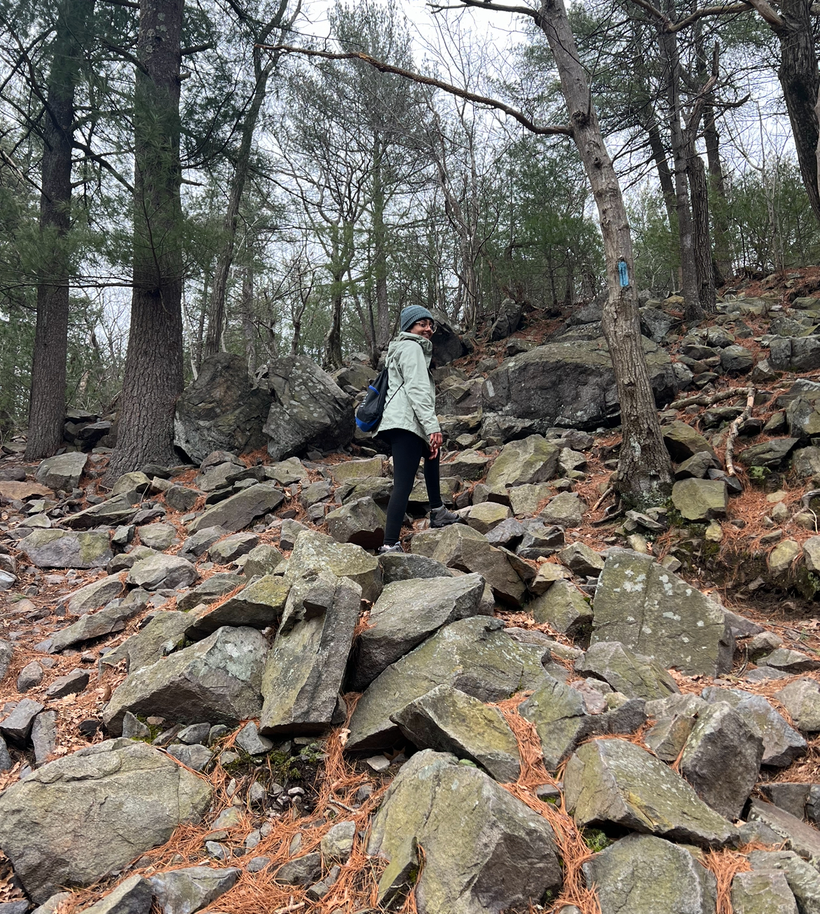
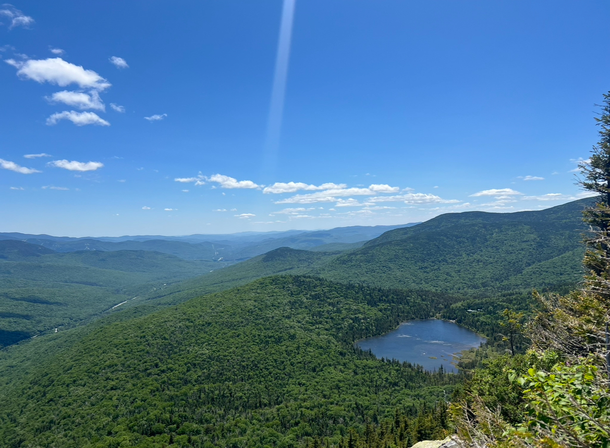
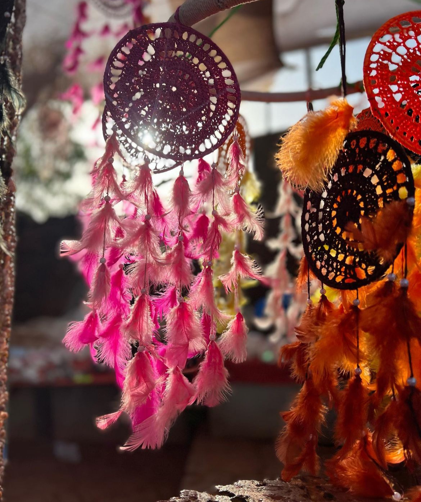

I grew up in Mangalore, a charming coastal town in India. My parents, both physicians, raised me alongside a large, supportive family, fostering an environment that encouraged both academic excellence and creative pursuits. I completed all my schooling in Mangalore and went on to graduate with a B.Tech in Electronics and Communication Engineering from [NITK, Surathkal](https://www.nitk.ac.in). My journey at NITK was marked by a deep dive into leadership roles and artistic endeavors, culminating in an Institute Gold Medal and the Best Outgoing Female Student Award by IEEE India Council and Hope Foundation.

My fascination with research began early on, driven by the idea that everything in the world can be understood through signals and numbers. Math was always my favorite subject—it just clicked for me. During my undergraduate years, I worked on projects ranging from emotion detection in speech to an internship at IISc focused on improving imaging resolution using Fourier ptychography. However, it was a course on Medical Image Analysis with Machine Learning that truly captivated my interest. This led me to a year-long internship at the [Machine Learning and Optimization Lab at EPFL](https://www.epfl.ch/labs/mlo/igh-intelligent-global-health/), headed by [Dr.Mary-Anne Hartely]( https://www.yale-light.org/) and [Dr. Martin Jaggi](https://people.epfl.ch/martin.jaggi), where I worked on lung sound analysis for respiratory ailments, particularly COVID-19. It felt like a full-circle moment—having grown up around hospitals, my first "toy" was probably a stethoscope, and my bachelor's thesis ended up being about developing an AI-powered stethoscope.

The experience of working on such crucial projects during the pandemic, alongside medical professionals, software engineers, and hardware experts, ignited a passion for biomedical engineering that brought me to Johns Hopkins for grad school. At JHU, I earned my MSE in Electrical Engineering on the way to pursuing a Ph.D. under the guidance of [Archana Venkataraman](https://www.bu.edu/eng/profile/archana-venkataraman-ph-d/). My coursework included deep learning projects like deepfake art generation, MRI super-resolution with sparse deep learning, and EEG-based imagined thought detection. My primary research, however, focuses on interpretable and trustworthy deep learning for diagnosing and predicting neurodegenerative diseases such as epilepsy and autism. I leverage Bayesian inference, optimization tools, deep learning, and high-dimensional signal processing in my work. Please refer to my CV and research section for more information.

Outside the lab, I express myself through art and stay actively involved in the community. I enjoy meeting new people and volunteering at events—I previously served on the Women in Machine Learning board and was the Social Evening Chair in 2022. During my undergrad years, I led one of the largest IEEE student branches in India as its Chairman. I'm also a trained Bharatanatyam dancer and a certified artist. You'll often find me wandering the city with my sketchbook, capturing scenes with my pen. I love hiking, recently exploring the White Mountains in New Hampshire. Some pictures below of my creative endevours while more can be found on my [Instagram](https://www.instagram.com/dee_mystify?utm_source=ig_web_button_share_sheet&igshid=ZDNlZDc0MzIxNw==).

    <figure style="text-align: center; width: 19%;">
        
        <figcaption>Painting</figcaption>
    </figure>
    <figure style="text-align: center; width: 19%;">
        
        <figcaption>Pencil sketch</figcaption>
    </figure>
    <figure style="text-align: center; width: 19%;">
        
        <figcaption>Hiking</figcaption>
    </figure>
    <figure style="text-align: center; width: 19%;">
        
        <figcaption>White mountains</figcaption>
    </figure>
    <figure style="text-align: center; width: 19%;">
        
        <figcaption>Photography</figcaption>
    </figure>

