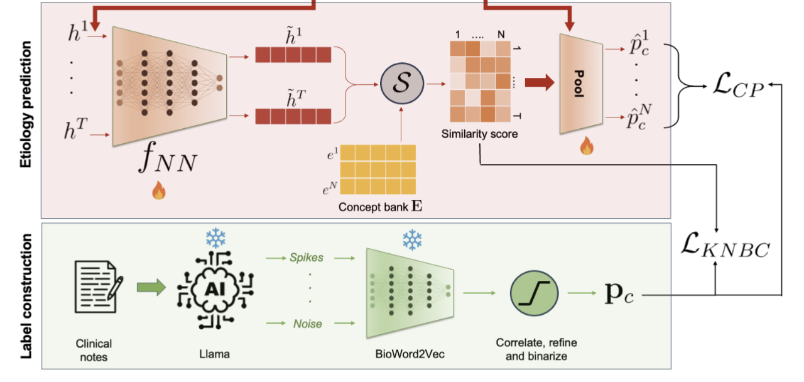
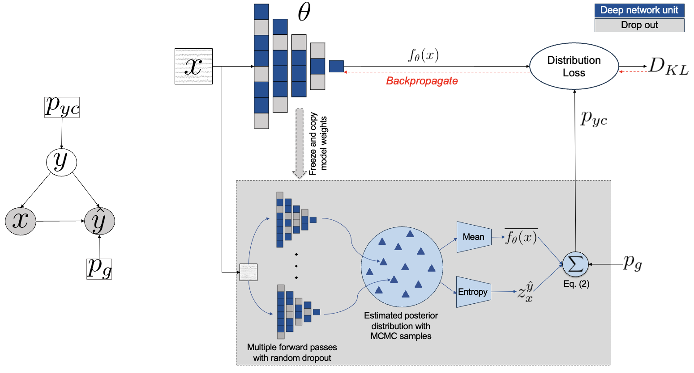
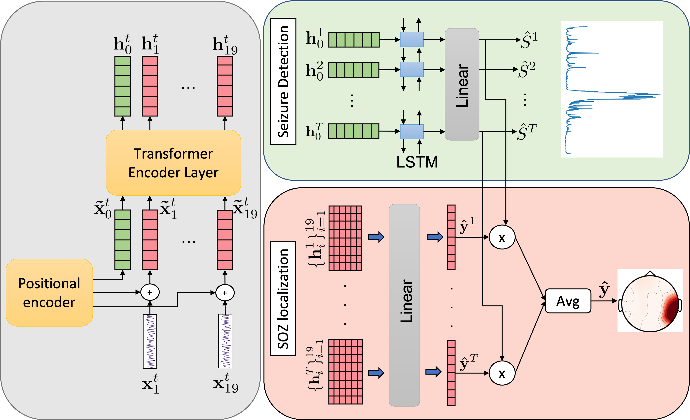
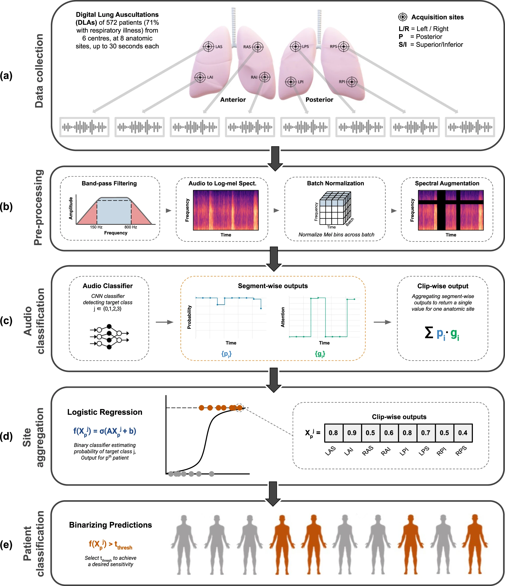
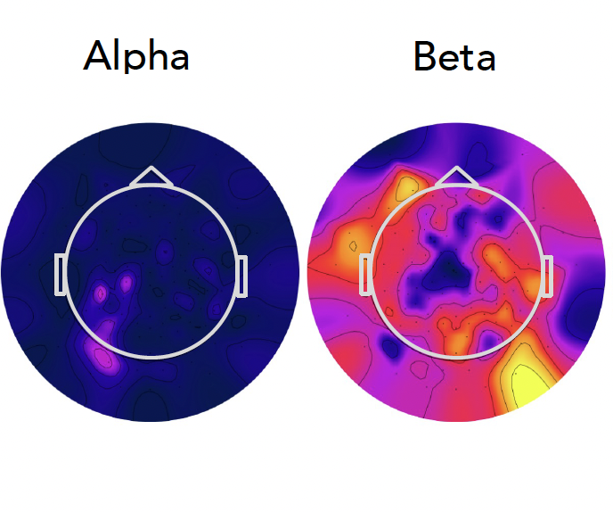

       <!-- Project 1 -->
    

        
        

            <h3 style="margin: 0;">LLM-Powered Cross-Modal Alignment for Explainable Seizure Detection</h3>
            
A novel plug-in framework to enhance the reasoning abilities of AI models for EEG-based seizure detection using cross-modality similarity layers to align the EEG encodings with textual concept embeddings derived from clinical notes using LLMs. Presented at MICCAI'25 main conference.

            <a href="https://github.com/deeksha-ms/SzXAI" target="_blank">GitHub</a> |
            <a href="https://papers.miccai.org/miccai-2025/paper/4626_paper.pdf" target="_blank">Paper</a>
        

    

 
    <!-- Project 1 -->
    

        
        

            <h3 style="margin: 0;">Uncertainty-Aware Bayesian Deep Learning with Noisy Training Labels for Epileptic Seizure Detection</h3>
            
Novel strategy to handle label noise with the target application of tackling inter-rater variability in seizure detection. Accepted at UNSURE@MICCAI'24. Long article coming soon.

            <a href="https://github.com/deeksha-ms/BUNDL" target="_blank">GitHub</a> | 
            <a href="https://openreview.net/forum?id=xWbV6wZjro" target="_blank">Paper</a>
        

    

    <!-- Project 2 -->
    

        
        

            <h3 style="margin: 0;">DeepSOZ: A Robust Deep Model for Joint Temporal and Spatial Seizure Onset Localization from Multichannel EEG Data from Multichannel EEG Data</h3>
            
Transformer-based network for multi-task framework with uncertainty quantification. Presented at MICCAI'23.

            <a href="https://github.com/deeksha-ms/DeepSOZ" target="_blank">GitHub</a> | 
            <a href="https://www.researchgate.net/publication/374346529_DeepSOZ_A_Robust_Deep_Model_for_Joint_Temporal_and_Spatial_Seizure_Onset_Localization_from_Multichannel_EEG_Data" target="_blank">Paper</a>
        

    

    <!-- Project 3 -->
    

        
        

            <h3 style="margin: 0;">DeepBreath—automated detection of respiratory pathology from lung auscultation in 572 pediatric outpatients across 5 countries</h3>
            
Involved in the initial model developement and the first draft of paper. Extended it for COVID-19 detection presented as my bachelor's thesis.

            <a href="https://github.com/EPFLiGHT/DeepBreath-NatMed23" target="_blank">GitHub</a> | 
            <a href="https://www.nature.com/articles/s41746-023-00838-3" target="_blank">Paper</a> | 
            <a href="https://drive.google.com/file/d/1Wl2DY26Q3cjZTJm6M_HKH7xrhODi9HlW/view?usp=sharing" target="_blank">Thesis</a>
        

    

## Mentored projects

        <!-- Project 4 -->
        

        
            

            <h3 style="margin: 0;">DeepSOZ-HEM at Seizure Detection Challenge </h3>
            
 Presented by Amruth, an undergraduate researcher in our lab, at the International Conference on Artificial Intelligence in Epilepsy and Other Neurological Disorders (2025). 
 
	    <a href="https://epilepsybenchmarks.com/benchmark/" target="_blank">SzCORE Benchmark</a> 
            

        

	<!-- Project 4 -->
	

        
            

	    <h3 style="margin: 0;">Interpretable and Lightweight Machine Learning Approach for Autism Classification Using Biomarkers Derived from Multi-trial Resting EEG</h3>
	    
 Presented by Michelle, an intern in our lab, at BU's RISE symposium. Short article coming soon.

 	    <a href="https://github.com/deeksha-ms/ITV_in_autism" target="_blank">Github</a> |
	    <a href="https://link.springer.com/article/10.1007/s10803-025-07125-y" target="_blank">Paper</a>   
	    

	

## Other projects

	<!-- Project 6 (No Icon) -->
	

        

            <h3 style="margin: 0;">Synthetic Telepathy: Inner Speech Recognition using EEG</h3>
            
Employed machine learning, clustering, and deep leanring methods to decode imagined speech from EEG. Group project for Machine learning and Signal processing course JHU'21

            <a href="https://github.com/carankt/synthetic_telepathy" target="_blank">Link</a> 
        

    

<!-- Project 7 (No Icon) -->
        

        

            <h3 style="margin: 0;">Neural style conversion with Generative models</h3>
            
Developed cycle-GAN and diffusion models for synthetic art generation. Group project for deep learning course JHU'22

            <a href="https://drive.google.com/file/d/1lNOuwv0pF20Orxw5M8MeiU5-QuuXLVjL/view?usp=sharing" target="_blank">Link</a>
        

    

<!-- Project 8 (No Icon) -->
        

        

            <h3 style="margin: 0;">Multi-Atlas Brain Segmentation And Age Prediction</h3>
	    
Developed 3D CNN model for brain age prediction after preprocessing 3D MR images for Medical Image Analysis course JHU'22

	    <a href="https://drive.google.com/file/d/1HgqMpQ4_KaoCnQx46hs0RZtyBv1dB0Jw/view?usp=sharing" target="_blank">Link</a>
        

    

